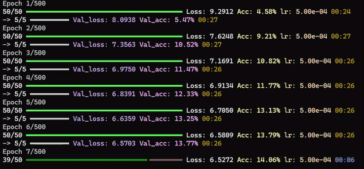

<div align="center">

# 🤖 LLM Pretraining in PyTorch 🤖

[](https://www.python.org/)
[](https://pytorch.org/)

Lightweight PyTorch-based LLM pretraining framework for training, testing, & exporting models in ONNX.

</div>

***

## ✨ Get started
Ensure you have **Python 3.12** installed. A CUDA-enabled GPU is strongly recommended for training.
### 📦 Install Dependencies
From the root project directory, install required Python packages:
```bash
$ pip install -r requirements.txt
```


<details>
  <summary>
  
  ## 📚 Dataset

  </summary>

### 🌐 Web Data
This project uses the [Openwebtext](https://huggingface.co/datasets/Skylion007/openwebtext) dataset via Hugging Face — the same dataset used to train GPT-2.
### 🔤 Tokenization
We use the `tiktoken` library (from OpenAI) to perform [Byte Pair Encoding (BPE)](https://en.wikipedia.org/wiki/Byte-pair_encoding) tokenization.
The vocabulary size is 50,257 tokens.
</details>


## 🔥 Training
### ⚙️ Config
Before training, configure hyperparameters in the `config.py` file to suit your needs.
### 🚀 Launch training
To start training:
```bash
$ python training.py
```

### 🔢 BF16 vs FP32
The model uses BFloat16 precision for training, resulting in:
- ~2× faster training
- ~2× lower VRAM usage
    (compared to standard FP32)
### 🖥️🔌🖥️🔌🖥️ Multi-GPU Support
Training automatically detects and utilizes all available GPUs by splitting batches evenly across devices.
### 📈 Visualization
Training logs are saved to `history.csv`. You can plot:
- Loss
- Accuracy
- Other custom metrics
using your favorite visualization tools (e.g., Excel, pandas, matplotlib).


## 🔁💬 Text Generation

To generate text with a trained model, run:
```bash
$ python inference.py
```


## 📊 ONNX Quantization (8-bit / 4-bit)

🛠️Work in progress